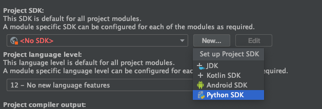
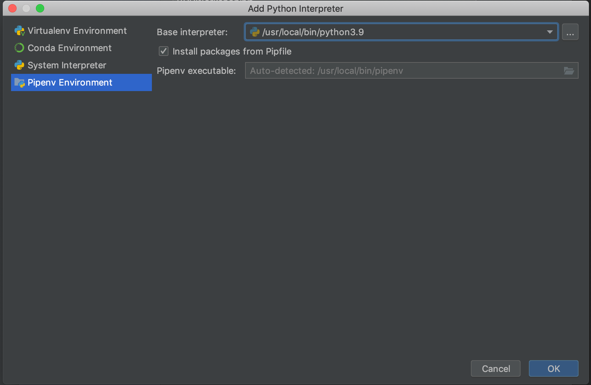

# Prerequisites 

1. Installed Python >= 3.8.

2. Pipenv, see: https://pypi.org/project/pipenv/#description

3. Execute `pipenv shell`, and then `pipenv install --dev`

4. [Optional] IntelliJ setup:

* Open this project in IntelliJ and wait til it's ready

* Set up`Pipenv Environment` as an interpreter in IntelliJ:

  * File -> Project structure

  * Dodaj nowe SDK: 
  
  * If `Python SDK` is missing on the list, then install IntelliJ plugin `Python`

  * Add python3 from `Pipenv Environment` catalog as the Python interpreter 

5. (Optional) Install `Gherkin` plugin  w IntelliJ.

6. In cas you use different IDE use `Pipenv` as the runtime

# Testowanie konfiguracji

1. W głównym katalogu, uruchom: `pipenv run behave --tags=@park-cash`.

2. Oczekiwanym rezultatem jest:

```
1 feature passed, 0 failed, 2 skipped
65 scenarios passed, 0 failed, 11 skipped
260 steps passed, 0 failed, 30 skipped, 0 undefined
Took 0m0.027s
```

## Sprawdzenie czy testowe API działa

3. W katalogu `todolist` uruchom:
```
pipenv shell

export FLASK_APP=app
export FLASK_ENV=development

flask run
```

4. Otwórz w przeglądarce: `http://127.0.0.1:5000/tasks`

5. Jeśli widzisz pustą listę to API działa:

```
[]
``` 
